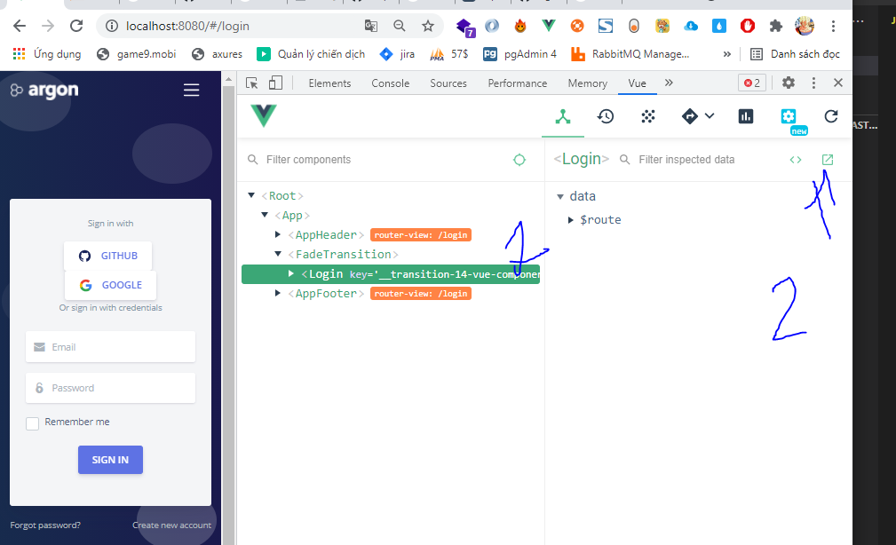
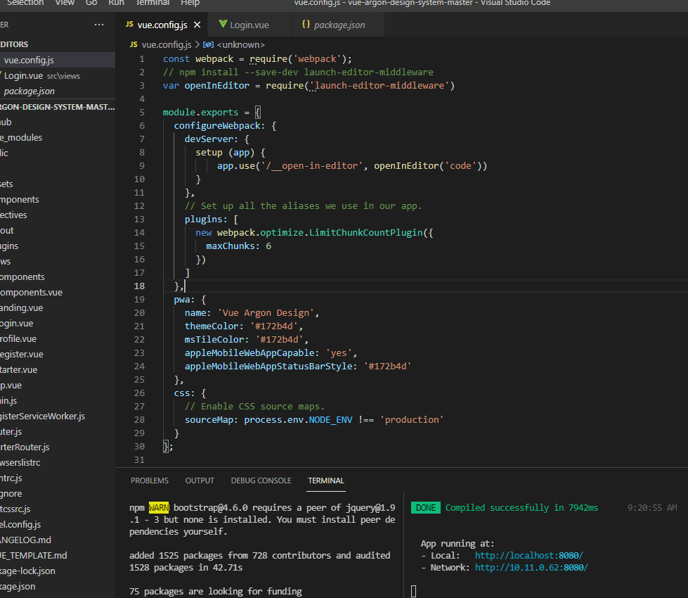

# how-to-use-function-open-vue-component-in-editor
how to use function open vue component in editor

problem: no effect when click 2



solutions:
```
open file vue.config.js
```

```js
npm install --save-dev launch-editor-middleware
```

```js
var openInEditor = require('launch-editor-middleware')
```

```js
module.exports = {
  configureWebpack: {
    devServer: {
      setup (app) {
          app.use('/__open-in-editor', openInEditor('code'))
      }
    }
}
}
```

restart server and retest
